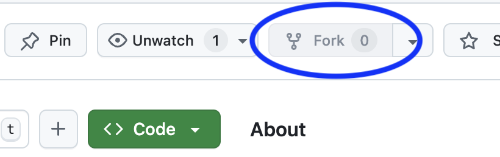

# CSIS11 Students

Repository for students to exchange homework with the instructor. 

### Important
1. **Please make sure your version of this repository on GitHub is private and is accessible by only the instructor and you.**
2. **Please do NOT make changes or add files to the Instructor folder, as this is where you will be able to download new versions of files from the instructor**

## Installation
   1. Login to GitHub
   2. On this repository, click the **Fork** button in the top-right corner of the page
   
   3. **Verify** your fork:
    - You'll be automatically redirected to your new forked repository
    - The URL will now show your username instead of the *lkoepsel*
    - You'll see an indication that it's "forked from [*this repository*]" under the repository name
   4. **Clone** your fork locally:
   ```bash
   git clone https://github.com/student-username/CSIS11_Students.git
   ```
   5. Add this repository as upstream:
   ```bash
   git remote add upstream https://github.com/lkoepsel/CSIS11_Students.git
   ```

## Ongoing Operations:

   1. To sync with *lkoepsel* (or class) updates:
   ```bash
   git fetch upstream
   git merge upstream/main
   ```

   2. For your work:
   - In *Finder/Explorer/VS Code* create week-specific folders in the ```student``` folder then commit and push to your fork using VS Code or CLI:
   ```bash
   git add -A # to add all of the changes
   git commit -m "adding my changes for week 5" # Commit your changes
   git push origin # push your change to your repository on GitHub
   ```
