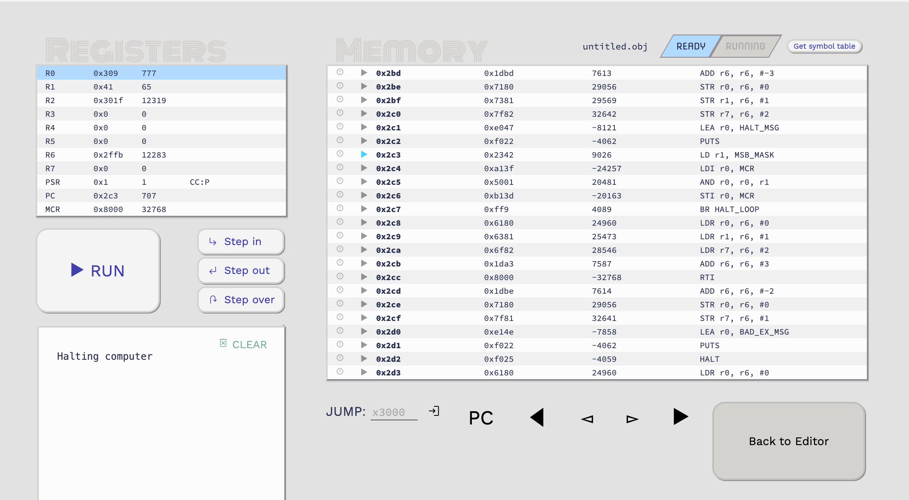

# Week 6 - Beginning LC-3 Assembly
## Instructions

1. **Copy and paste this content into a new file in Week 6 in your student folder.**
2. Follow the assignment by writing code or pasting images from the simulator into **your file**.
3. All supplied programs will be in the *code* folder for that specific week

## 6a - Learn how to use the tools

### Objectives
1. Learn how to integrate git and Github into your homework
2. Learn how to edit simple LC-3 assembly programs
3. Learn how to use the LC-3 simulator

### Assignment

#### shift_left_match.asm

1. Copy the file from the instructor/week_6 to your week_6 folder
1. Make changes such that VALUE is xB0B0 and MATCH is x1600
2. Run in the simulator and provide a screenshot showing the result when the program has **successfully** finished. 


#### shift_left_n.asm

1. Copy the file from the instructor/week_6 to your week_6 folder
2. Make changes such that the COUNT is #10 (decimal 10)
3. What are the numbers shown in the console?
   :987654321
4. What is the first character and why isn't it decimal 10?
   The first character is : and it's because on the ASCII Table 58 is : that comes after 9. 

```lc3

; shift_left_n - 
; Demonstrates:
; how to shift a word to the left
; how to convert a number to ASCII and output it
; how to loop until a value is not positive (n)

; Usage:
; Use x0A0A for VALUE, and #3 for COUNT
; Result in R1 will be xA0A0
; Only works for 1-9 shifts, due to ASCII conversion

; Registers:
; R1 - VALUE to shift
; R2 - COUNT
; R3 - ASCII conversion value
; Memory:
; x3000 - start of program
; x3009 - VALUE, number to shift
; x300A - COUNT, n shifts
; x300B - ASCII, increment to convert number to ASCII

        .ORIG x3000     ; 
        LD R1, VALUE    ; load the value to shift into R1
        LD R2, COUNT    ; load counter value in to R2
        LD R3, ASCII    ; load the ASCII increment into R3

SHIFT   ADD R1, R1, R1  ; shift the value left
        ADD R0, R2, R3  ; convert COUNT to ASCII
        OUT             ; output the COUNT ASCII value
        ADD R2, R2, #-1 ; decrement COUNT
        BRp SHIFT       ; continue until counter goes to 0

        HALT            ; stop the program
VALUE   .FILL x0A0A     ; value to shift
COUNT   .FILL #10       ; number of shifts (n, n-1, n-2, ... 1)
ASCII   .FILL x0030     ; increment for making a number, ASCII
        .END            ; end of source code
```


#### addnums.asm
1. Copy the file from the instructor/week_6 to your week_6 folder
2. Change the file such that the final sum is x0085 (the original sum is 55)
2. Run in the simulator and provide a screenshot showing the result when the program has finished. 


#### addnums.asm -> subnums.asm
1. Copy the file from the instructor/week_6 to your week_6 folder
2. Change the file such that the values are **subtracted**, instead of added
2. Paste the complete code here, in between the code fences
```lc3

; add_nums - 
; Demonstrates
; how to loop N times
; how to setup an array in memory
; how to use indirect addressing

; Registers:
; R1 - running sum
; R2 - pointer to data
; R3 - next number to be added
; R4 - counter
; Memory:
; x3000 - start of program
; x300A - N_DATA, number of data elements
; x300B - DATA, first data element

        .ORIG x3000    
        AND R1, R1, x0 ; clear R1, running sum
        AND R4, R4, x0 ; clear R4, counter
        LD  R4, N_DATA ; load R4 with number of data points
        LEA R2, DATA   ; load the starting address of the data

LOOP    LDR R3, R2, x0 ; load the next number to be added
        ADD R2, R2, #2 ; increment the pointer
        ADD R3, R3, #1 ;
        ADD R1, R1, R3 ; add the next number to the running sum
        ADD R4, R4, #-1 ; decrement the counter
        BRp LOOP       ; do it again if the counter is not yet zero
        HALT           ; halt

N_DATA  .FILL x0A      ; number of data elements
DATA    .FILL x05      ; first data element
        .FILL x07    
        .FILL x09    
        .FILL x0B    
        .FILL x0D    
        .FILL x0F    
        .FILL x11    
        .FILL x13    
        .FILL x15   
        .FILL x17    
        .END


```
 
## 6b - Explore how to use data

### Objectives
1. Learn how to specify data in assembly
2. Learn how to use data in coding
3. Learn the limits of data locations

### Assignment

For each exercise, please do the following:
- Write complete, working LC-3 assembly code
- Include comments explaining your approach
- Test your code in the LC-3 simulator
- Document how they handled memory constraints and register usage
- **Provide your code developed, in code fences, after each assignment.**

1. **Variable Declaration and Access**
   Write LC-3 assembly code to:
   - Declare a variable named ```COUNT``` with initial value 5
   - Increment it by 1
   - Store the result back in ```COUNT```

```lc3

; remove this comment and paste your code here

```

2. **Case Sensitivity Practice**
   Determine if these labels refer to the same variable:
   ```assembly
   TOTAL   .FILL   #10
   total   .FILL   #20
   Total   .FILL   #30
   ```
   Explain your answer.

```lc3

; remove this comment and paste your code here

```

3. **Pointer Usage**
   Write code to:
   - Create a pointer variable ```PTR``` that points to a value
   - Use LDI to load the value it points to into R1
   - Use STI to store a new value through the pointer

```lc3

; remove this comment and paste your code here

```

## Simple Math Calculator

### Part 1 - Add and Subtract

1. Create a new folder in your student folder called SMC.
2. Add a file called add_sub.asm
3. Write the code which will add and subtract 2 numbers. Be sure to label your variables so they are easy to reference.
4. Use a ASCII "+" to determine if you add and an ASCII "-", for subtraction, think of it from a "conditional" perspective.

```lc3

; remove this comment and paste your code here

```
