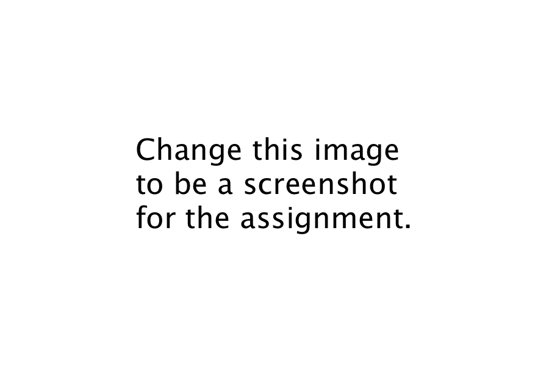

# Week 6 - Beginning LC-3 Assembly
## Instructions

1. **Copy and paste this content into a new file in Week 6 in your student folder.**
2. Follow the assignment by creating code or pasting images from the simulator into **your file**.

## 6a - Learn how to use the tools

### Objectives
1. Learn how to integrate git and Github into your homework
2. Learn how to edit simple LC-3 assembly programs
3. Learn how to use the LC-3 simulator

### Assignment

#### shift_left_match.asm
1. Copy the file from the instructor/week_6 to your week_6 folder
1. Make changes such that VALUE is xB0B0 and MATCH is x1600
2. Run in the simulator and provide a screenshot showing the result when the program has **successfully** finished. 

#### shift_left_n.asm
1. Copy the file from the instructor/week_6 to your week_6 folder
2. Make changes such that the COUNT is x10
3. What are the numbers shown in the console?

4. What is the last character and why isn't it 10?

#### addnums.asm
1. Copy the file from the instructor/week_6 to your week_6 folder
2. Change the file such that the final count is x0055
2. Run in the simulator and provide a screenshot showing the result when the program has finished. 

#### addnums.asm
1. Copy the file from the instructor/week_6 to your week_6 folder
2. Change the file such that the final count is x0055
2. Run in the simulator and provide a screenshot showing the result when the program has finished. 

## 6b - Explore how to use data

### Objectives
1. Learn how to specify data in assembly
2. Learn how to use data in coding
3. Learn the limits of data locations

### Assignment

